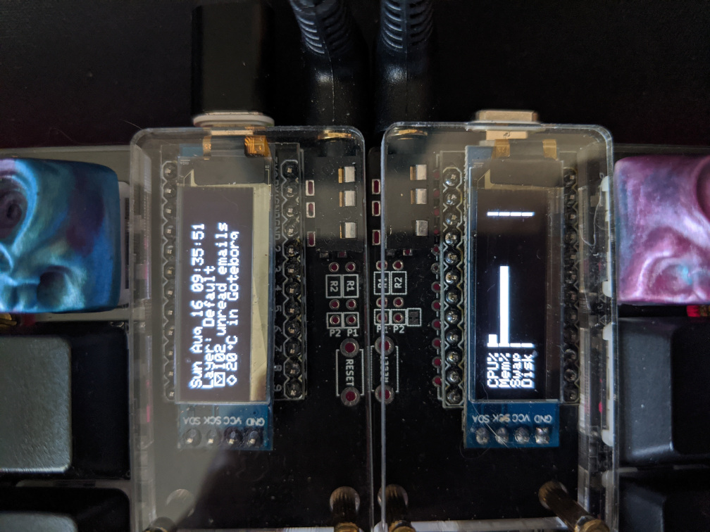

# OLED controller

This project includes a program to control the content of the OLED screen(s) accompanied with certain keyboards that use
the [QMK firmware](https://github.com/Drauthius/qmk_firmware), such as the Lily58. Support has to be built into the
firmware, and the firmware flashed to the keyboard, before this program can be used.

In addition to proper support in the firmware, this program uses a custom
[`glcdfont.c`](https://github.com/Drauthius/qmk_firmware/tree/master/keyboards/lily58/keymaps/albhen/glcdfont.c) file
to show special icons for the bars, weather condition, fan, etc.

The program comes pre-programmed with three different views (called tags), which can be shown on two OLED screens.
Events from the keyboard can be sent to switch between the different tags.

## System status integration

Shows bar graphs representing the current utilization of the system.
* CPU% - Total CPU utilization for all cores and hyperthreads.
* Mem% - Memory utilization.
* Swap - Swap (page file) utilization.
* Disk - Disk I/O utilization.

On Linux, the flag `-sysstat-disk` can be specified to select for which harddisk to show utilization.

## GMail integration

Shows the number of unread messages for a certain label. This can be set up in multiple ways, but for a personal GMail
account, go to https://console.developers.google.com, create a new project, enable the GMail API, and then under
credentials create a new OAuth 2.0 Client ID. Download the JSON credentials file for that Client ID, and specify the
path to it using the `-gmail-credentials` flag to the OLED controller program. The OLED controller program will output
an URL that you need to visit, and after completing authentication, the website will show a token that needs to be
input to the OLED controller. Once this has been done once, the credentials will be cached, and the operation doesn't
need to be performed again (though you still need to specify the path to the downloaded credentials file).

## OpenWeatherMap integration

Shows the current temperature and weather condition in a specified location. An account needs to be created at
https://openweathermap.org, where you will get a personal API key that needs to be passed to the program using the
`-weather-api-key` flag, together with the desired location for which to get the current weather with the
`-weather-location` flag. The location should be specified in the format `<city>,<country>`, e.g. "Los Angeles,US".

The temperature is in Celsius by default. This can be changed with the `-temperature-unit` flag.

## NVIDIA integration

Shows bar graphs representing the current utilization of the graphic card, as well as the current temperature.
* GPU% - GPU utilization.
* Mem% - Memory utilization.
* PCIe - PCIe bus utilization.
* Fan - Intended fan speed.

The temperature is in Celsius by default. This can be changed with the `-temperature-unit` flag.

NVML, NVIDIA Management Library, is used to gather status from the graphic card. A shared library needs to be installed
locally for this to work. On Linux, the shared library is called "libnvidia-ml.so", which probably comes together with
the NVIDIA drivers. On Windows the library is called "nvml.dll", and can be found in the CUDA toolkit.

## License

Copyright 2020 Albert "Drauthius" Diserholt. All rights reserved.
Licensed under the MIT License.
